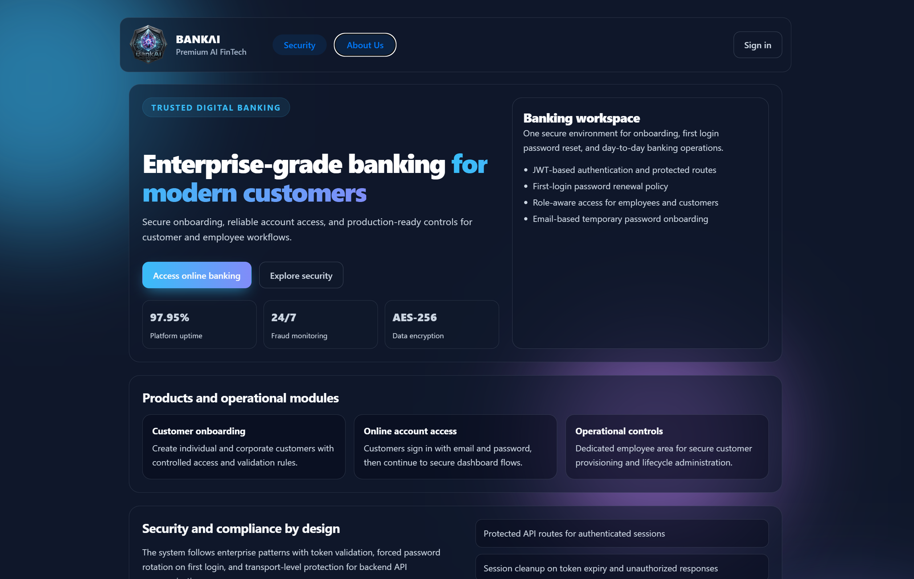
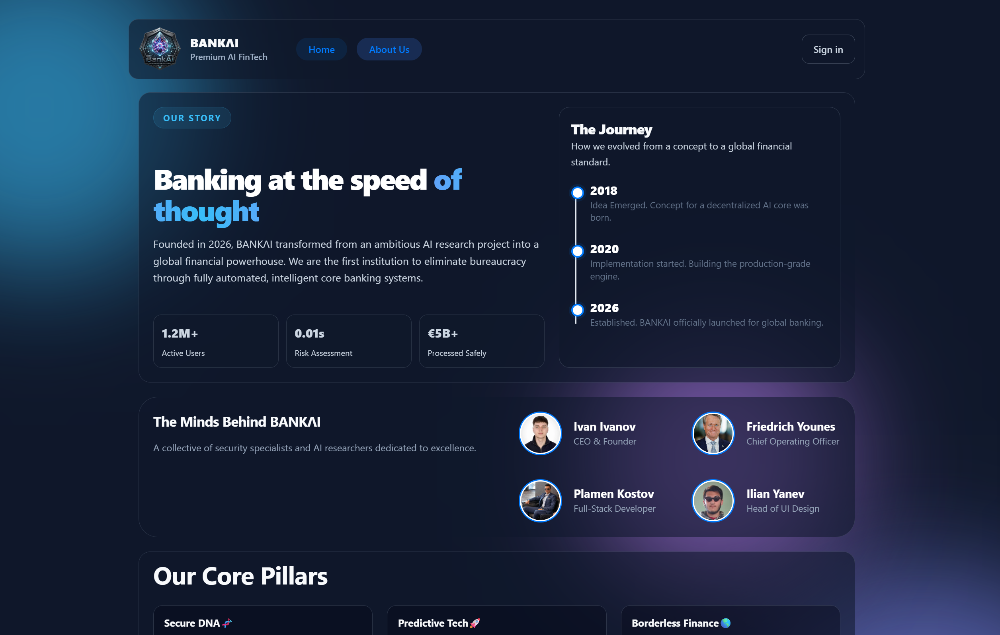
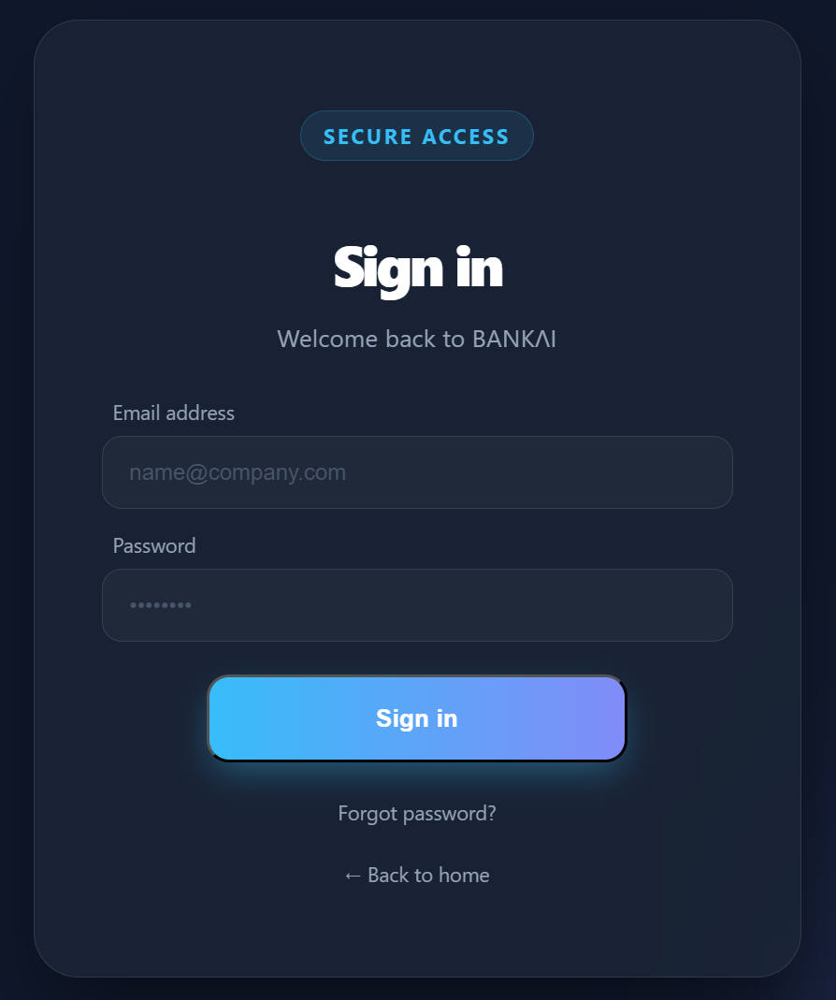
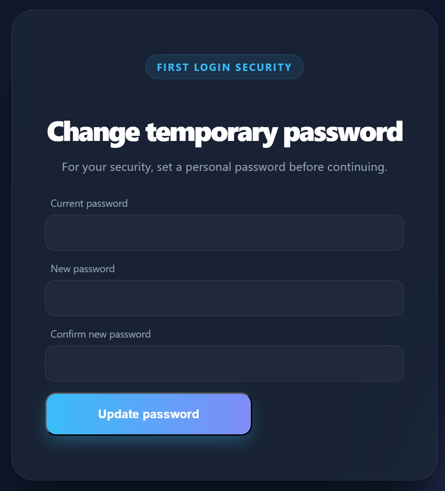
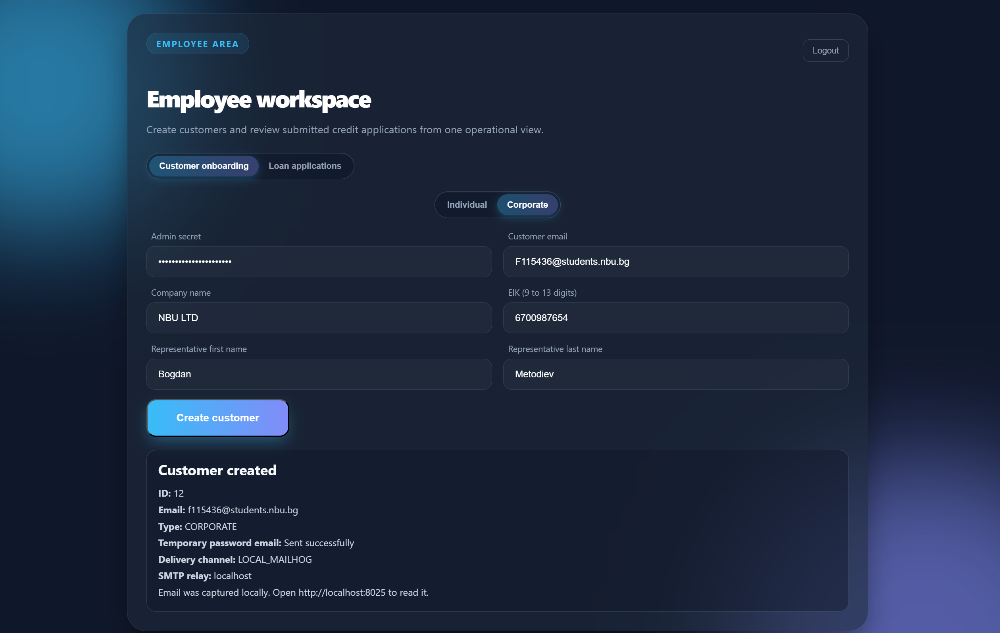
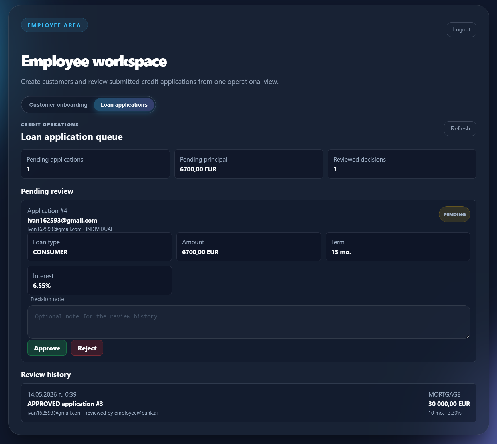
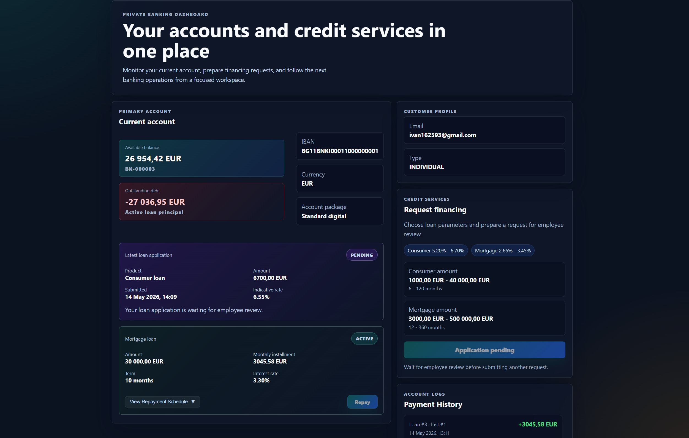
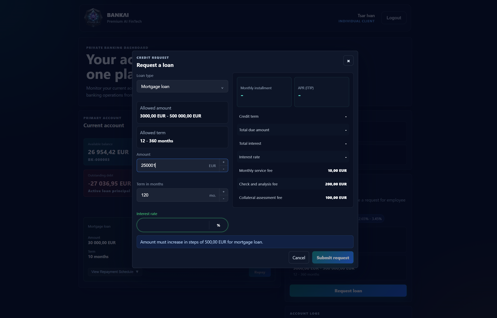
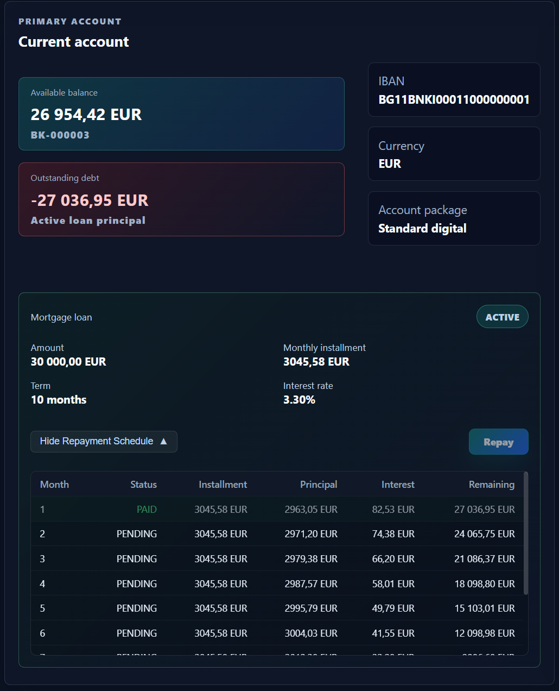
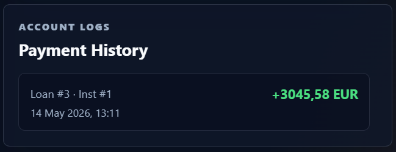

<div align="center">

# BANKAI Bank System 🏦


 <br>


> A full-stack digital banking system with customer onboarding, secure authentication, account management, loan applications, employee approval flow, annuity repayment schedules, installment repayment, and transaction-style payment history.

**BANKAI** is built as a monorepo with a Spring Boot backend, a React + TypeScript frontend, Flyway-managed MySQL schema, and Dockerized local infrastructure. The project is designed to feel like a real banking workspace: customers apply for credit, employees review applications, approved funds are transferred to accounts, and every repayment is recorded.

</div>
<br>

## 📌 Table of Contents

- [✨ Core Features](#core-features)
- [👥 Contributors](#contributors)
- [📸 Preview](#preview)
- [🧰 Tech Stack](#tech-stack)
- [🗄️ Database Schema](#database-schema)
- [📂 Project Structure](#project-structure)
- [🔌 Main API Surface](#main-api-surface)
- [⚙️ Installation & Setup](#installation--setup)

<br>

<a id="core-features"></a>
## ✨ Core Features

### 🔐 Authentication & Security

- JWT-based authentication for `CUSTOMER` and `EMPLOYEE` users.
- Role-aware protected routes in both backend and frontend.
- Automatic frontend session cleanup on expired or invalid tokens.
- First-login password change flow for newly onboarded customers.
- Password reset mechanism with expiring hashed reset tokens.
- Employee-only operational area and customer-only banking dashboard.

### 👤 Customer Onboarding

- Individual customer registration with name, EGN, email, and validation rules.
- Corporate customer registration with company name, EIK, representative data, and email.
- Admin-secret protected onboarding endpoints for controlled provisioning.
- Temporary password delivery through SMTP.
- Local MailHog support for development and external SMTP support for real email delivery.
- Onboarding response shows whether the temporary password email was sent and through which relay.

### 💳 Account Management

- Customers can open a current bank account after authentication.
- The dashboard displays IBAN, account status, available balance, and customer reference.
- Account status supports active and closed accounts.
- Outstanding credit debt is calculated and visualized next to the account balance.
- Loan disbursement credits the approved principal directly to the active customer account.

### 🏦 Credit Products & Loan Applications

- Consumer and mortgage loan products are handled through centralized product policy rules.
- Product-specific limits:

| Product | Amount range | Term range | Principal step |
| --- | --- | --- | --- |
| Consumer loan | 1,000.00 - 40,000.00 EUR | 12 - 120 months | 5.00 EUR |
| Mortgage loan | 3,000.00 - 500,000.00 EUR | 12 - 360 months | 500.00 EUR |

- Indicative annual interest rate is calculated dynamically from product type, principal, and term.
- Customer loan form includes a live preview of:
  - indicative interest rate,
  - monthly installment,
  - total due amount,
  - total interest,
  - APR,
  - product fees.
- Customers must have an active bank account before applying for credit.
- Customers can have only one pending loan application at a time.
- Employees can approve or reject applications with an optional decision note.
- Employee workspace includes pending applications, pending principal exposure, and full review history.

### 📈 Annuity Repayment Schedule

- Approved loans automatically generate a month-by-month annuity repayment plan.
- Monthly installments remain stable for the whole period.
- In the beginning, a larger part of the installment is interest.
- Toward the end, the principal part grows while the interest part decreases.
- Interest is always calculated over the remaining principal.
- Each installment stores:
  - due date,
  - monthly installment amount,
  - principal part,
  - interest part,
  - remaining balance,
  - status,
  - payment timestamp.

### 💸 Repayment & Payment History

- Customers can repay the next pending installment from the dashboard.
- Repayment debits the customer's active account.
- Paid installments are marked as `PAID`.
- Fully repaid loans are automatically closed.
- Every installment payment is written to a dedicated log.
- Customer view includes a transaction-style payment history showing processed repayments.

### 🖥️ User Interface

- Public landing page with BANKAI branding and product/security overview.
- About Us page.
- Login page.
- First-login password change page.
- Password reset page.
- Customer dashboard with account, loan, debt, repayment, and payment history panels.
- Employee workspace with customer onboarding and loan review tabs.
- Responsive UI built with React, TypeScript, Vite, Axios, and React Router.

<a id="contributors"></a>
## 👥 Contributors

| Contributor | Faculty number | Role | Contribution |
| --- | --- | --- | --- |
| **Ivan Ivanov** | F115436 | Full-stack developer | Built most of the customer dashboard and customer-facing functionality, the loan approval/rejection mechanism, the credit disbursement flow, loan preview calculations, fee calculations, indicative interest-rate mechanism, password recovery flow, BANKAI logo, Flyway migrations after `V2`, and part of the integration tests. |
| **Plamen Kostov** | F113851 | Backend developer | Designed the backend architecture, Docker containerization, and the first two Flyway migrations. Implemented SMTP delivery for temporary onboarding passwords, the first-login password setup flow, repayment schedule visualization, and the loan repayment mechanism. |
| **Ilian Yanev** | F115564 | UI/UX developer | Designed the landing page, About Us page, and major UI/UX improvements in the customer view. Added unit tests and completed the remaining integration test coverage. |

<a id="preview"></a>
## 📸 Preview


### 1. Landing Page

*The public face of BANKAI with branding, navigation, and core banking value proposition.*



### 2. About Us

*Team and product identity page presenting the people behind the banking system.*



### 3. Secure Login

*Authentication entry point for customers and employees.*



### 4. First Login Password Change

*Mandatory password replacement after receiving a temporary onboarding password.*



### 5. Employee Customer Onboarding

*Operational form for creating individual and corporate customers.*



### 6. Employee Loan Review Desk

*Pending loan applications, approval/rejection actions, decision notes, and review history.*



### 7. Customer Dashboard

*Main customer workspace with account balance, IBAN, outstanding debt, profile, and credit services.*



### 8. Loan Application Calculator

*Interactive loan request modal with product terms, calculated fees, indicative interest rate, APR, and total due amount.*



### 9. Approved Loan & Repayment Schedule

*Approved loan card with monthly annuity repayment schedule, principal, interest, remaining balance, and installment status.*



### 10. Payment History

*Transaction-style history of processed installment repayments in the customer view.*



<a id="tech-stack"></a>
## 🧰 Tech Stack

### Backend

| Technology | Usage |
| --- | --- |
| Java 21 | Backend language |
| Spring Boot 4.0.5 | Application framework |
| Spring Web MVC | REST API |
| Spring Security | Authentication and authorization |
| Spring Data JPA | Persistence layer |
| Hibernate | ORM |
| Flyway | Database migrations |
| JJWT | JWT issuing and validation |
| Lombok | Boilerplate reduction |
| Gradle | Build tool |
| JUnit 5 + Testcontainers | Unit and integration testing |

### Frontend

| Technology | Usage |
| --- | --- |
| React 19 | UI library |
| TypeScript 5.9 | Typed frontend development |
| Vite 8 | Frontend tooling |
| React Router DOM | Client-side routing |
| Axios | HTTP client |
| ESLint | Static code analysis |

### Infrastructure

| Technology | Usage |
| --- | --- |
| MySQL 8.0 | Relational database |
| Docker Compose | Local infrastructure |
| MailHog | Local SMTP inbox |

<br>

<a id="database-schema"></a>
## 🗄️ Database Schema

Flyway manages the schema through migrations located in `bank-system/src/main/resources/db/migration`.


### Main Tables

| Table | Purpose |
| --- | --- |
| `customers` | Base user record with email, password hash, first-login flag, role, and customer type. |
| `individual_customers` | Individual customer profile with first name, last name, and unique EGN. |
| `corporate_customers` | Corporate customer profile with company name, unique EIK, and representative data. |
| `bank_accounts` | Customer accounts with IBAN, balance, account status, and owner reference. |
| `loans` | Loan applications and active loans with type, principal, interest rate, repayment term, status, and review metadata. |
| `installments` | Generated annuity repayment schedule for each loan. |
| `installment_payments_log` | Audit log for processed installment payments. |
| `loan_review_logs` | Employee approval/rejection history with decision notes and reviewed loan terms. |
| `password_reset_tokens` | Hashed password reset tokens with expiry and used timestamp. |

### Migration Timeline

| Migration | Owner | Description |
| --- | --- | --- |
| `V1__initial_schema.sql` | Plamen Kostov | Base customers, accounts, loans, and installments schema. |
| `V2__password_reset_tokens.sql` | Plamen Kostov | Password reset token persistence. |
| `V3__loan_product_term_constraints.sql` | Ivan Ivanov | Database-level constraints for loan product limits. |
| `V4__loan_application_review_flow.sql` | Ivan Ivanov | Pending/rejected loan statuses and employee review logs. |
| `V5__repayment_logs.sql` | Ivan Ivanov | Installment payment logging. |


<a id="project-structure"></a>
## 📂 Project Structure

```text
bank-system/
├── bank-system/                 # Spring Boot backend
│   ├── src/main/java/com/nbu/bank_system
│   │   ├── config/              # Security, bootstrap, and application configuration
│   │   ├── controller/          # REST controllers
│   │   ├── domain/              # Entities and enums
│   │   ├── dto/                 # Request and response contracts
│   │   ├── repository/          # Spring Data repositories
│   │   ├── security/            # JWT filter, principal, and user details service
│   │   └── service/             # Business services and loan policy logic
│   └── src/main/resources
│       └── db/migration/        # Flyway SQL migrations
├── bank-frontend/               # React + TypeScript frontend
│   ├── src/api/                 # Axios API clients
│   ├── src/components/          # Route guards and shared behavior
│   ├── src/pages/               # Application views
│   ├── src/types/               # Frontend DTO types
│   └── src/utils/               # Session storage utilities
├── docker/                      # Docker Compose infrastructure
└── docs/screenshots/            # README and presentation screenshots
```

<a id="main-api-surface"></a>
## 🔌 Main API Surface

| Area | Method | Endpoint | Description |
| --- | --- | --- | --- |
| Auth | `POST` | `/api/auth/login` | Authenticate user and return JWT session data. |
| Auth | `POST` | `/api/auth/change-password` | Change password during first login or normal authenticated session. |
| Auth | `POST` | `/api/auth/password-reset/request` | Send password reset link. |
| Auth | `POST` | `/api/auth/password-reset/confirm` | Confirm reset token and save new password. |
| Admin onboarding | `POST` | `/api/admin/secret/onboarding/individual` | Create individual customer using admin secret. |
| Admin onboarding | `POST` | `/api/admin/secret/onboarding/corporate` | Create corporate customer using admin secret. |
| Customer accounts | `GET` | `/api/customer/accounts/status` | Load current account, balance, and debt status. |
| Customer accounts | `POST` | `/api/customer/accounts/open` | Open a current bank account. |
| Customer loans | `POST` | `/api/customer/loans/applications` | Submit loan application. |
| Customer loans | `GET` | `/api/customer/loans/applications/latest` | Load latest loan application status. |
| Customer loans | `GET` | `/api/customer/loans` | Load all customer loans and repayment schedules. |
| Customer loans | `POST` | `/api/customer/loans/{loanId}/repay` | Repay the next pending installment. |
| Customer loans | `GET` | `/api/customer/loans/logs` | Load installment payment history. |
| Employee loans | `GET` | `/api/employee/loans/applications/pending` | Load pending loan applications. |
| Employee loans | `POST` | `/api/employee/loans/applications/{loanId}/approve` | Approve pending application and generate repayment schedule. |
| Employee loans | `POST` | `/api/employee/loans/applications/{loanId}/reject` | Reject pending application. |
| Employee loans | `GET` | `/api/employee/loans/applications/history` | Load employee loan review history. |


<a id="installation--setup"></a>
## ⚙️ Installation & Setup

### Prerequisites

- Java 21
- Node.js 20 or newer
- npm
- Docker Desktop
- Git

### 1. Clone the Repository

```powershell
git clone https://github.com/ITIvanov18/bank-system
cd bank-system
```

### 2. Start MySQL and MailHog

```powershell
docker compose -f docker/docker-compose.yml up -d
```

This starts:

- MySQL on `localhost:3307`
- MailHog SMTP on `localhost:1025`
- MailHog inbox UI on `http://localhost:8025`

### 3. Configure Backend Environment

```powershell
Copy-Item "bank-system/.env.example" "bank-system/.env"
```

The default local values are ready for the provided Docker Compose setup.

| Variable | Purpose |
| --- | --- |
| `SPRING_DATASOURCE_URL` | JDBC URL for MySQL. |
| `SPRING_DATASOURCE_USERNAME` | Database username. |
| `SPRING_DATASOURCE_PASSWORD` | Database password. |
| `APP_ADMIN_SECRET` | Secret required by the admin onboarding endpoints. |
| `BOOTSTRAP_EMPLOYEE_EMAIL` | Initial employee login email. |
| `BOOTSTRAP_EMPLOYEE_PASSWORD` | Initial employee login password. |
| `JWT_SECRET_BASE64` | JWT signing secret. |
| `MAIL_HOST`, `MAIL_PORT` | SMTP server used for temporary password and reset emails. |
| `MAIL_SMTP_AUTH`, `MAIL_SMTP_STARTTLS`, `MAIL_SMTP_SSL` | SMTP security flags. Keep them `false` for local MailHog. |
| `APP_MAIL_FROM` | Sender address for system emails. |

### 4. Run the Backend

```powershell
cd bank-system
.\gradlew.bat bootRun
```

### 5. Run the Frontend

Open a second terminal:

```powershell
cd bank-frontend
npm install
npm run dev
```

The frontend starts on `http://localhost:5173`.

### 6. Check Local Emails

Open MailHog after onboarding a customer or requesting a password reset:

```text
http://localhost:8025
```

Temporary passwords and reset links will be captured there in local development.

### 7. Useful Commands

```powershell
# Backend tests
cd bank-system
.\gradlew.bat test

# Frontend build
cd bank-frontend
npm run build

# Stop local infrastructure
docker compose -f docker/docker-compose.yml down
```


